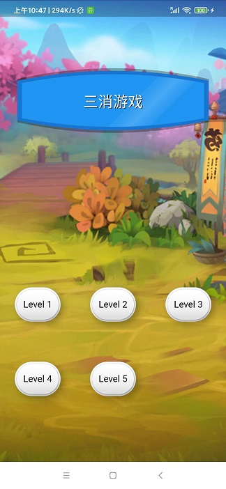
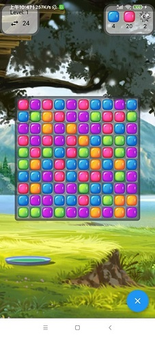

# 消消乐
本项目演示了如何用flutter构建一个三消类游戏，类似于开心消消乐、宾果消消乐、天天爱消除类

  

---
## 原作者相关信息
- 本项目的博客说明 https://www.didierboelens.com/2018/11/flutter-crush/
- github项目地址 https://github.com/boeledi/flutter_crush
## 本项目来源
原作者在flutter beta版本的时候便开始了本项目的开发，所以截止到目前原项目在最新的flutter版本上己无法运行。经过升级适配后大家可以无需任何改动，clone 本项目代码后便可以直接运行体验和学习。

## screenshots

## 视频演示

如果视频未显示可以点击打开查看演示

## 本项目改动
- 升级了flutter和dart的版本
- 修复了当前己被废弃的API写法
- 精简了pubspec.yml的配置
- 添加了启动图和ICON
- 修改了项目的名字

## 鸣谢
- [boeledi](https://github.com/boeledi)